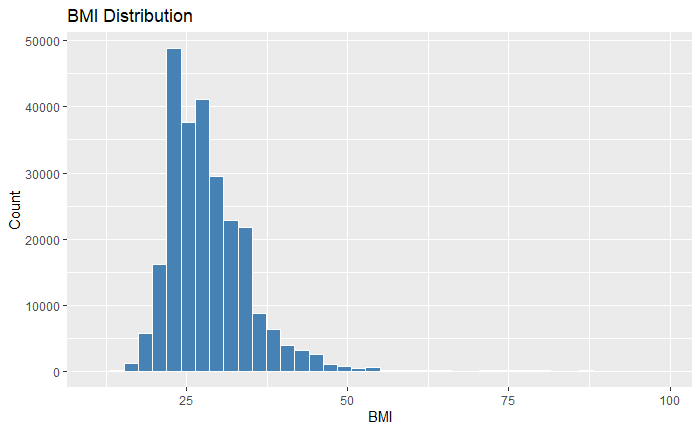
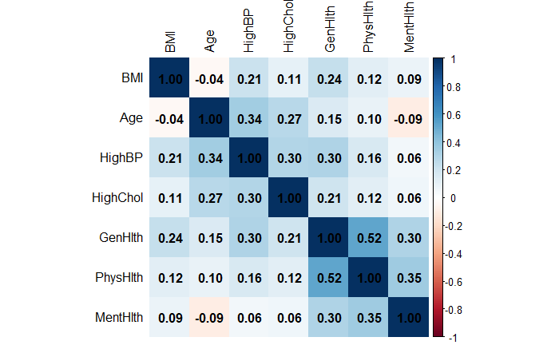
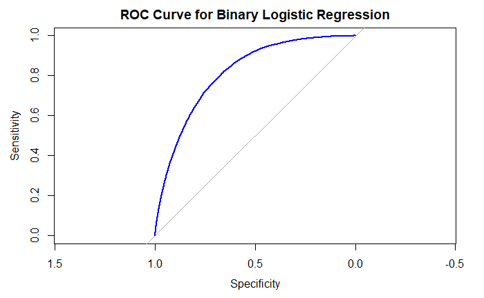

# Diabetes Risk Classification: Comparing Two Modeling Approaches

This project compared two models of predicting diabetes risk using 253,680 records from a CDC health survey. A binary model (at-risk vs. not at-risk) reached **84.7% accuracy with an AUC of 0.81**, clearly beating a three-category model (64.8% accuracy) that attempted to separate prediabetes from diabetes. The main takeaway: if accuracy is your desired metric, the binary model is the better tool.

## Business Problem

More than 38 million U.S. adults have diabetes, and catching at-risk people early, especially those with prediabetes, can prevent the disease from progressing. This project tested a practical question: is it worth building a more complicated model that treats prediabetes as its own category, or does a simpler yes/no risk model do a better job? The answer matters for anyone designing a health screening tool.

## Data

- **Source:** [Diabetes Health Indicators, BRFSS 2015 (Kaggle)](https://www.kaggle.com/datasets/alexteboul/diabetes-health-indicators-dataset), from the CDC's annual national health survey
- **Size:** 253,680 complete records with no missing values
- **Features:** BMI, age, high blood pressure, high cholesterol, physical activity, smoking, self-reported health ratings, difficulty walking, education, income
- **Target:** diabetes status (No Diabetes / Prediabetes / Diabetes, combined into at-risk vs. not for the binary model)

## Approach

1. **Research:** Reviewed three published studies that used this same survey data to ensure variable and model selection lined up with what is typically recognized in real public health research.
2. **Exploratory analysis:** Summary statistics and a correlation heatmap confirmed the predictors were usable and not too correlated with each other (all correlations under 0.60), so all predictors were included.
3. **Handling imbalance:** Very few people in the data had prediabetes compared to the other groups, which made it hard for the model to learn that category. Up-sampling the training data balanced this out.
4. **Modeling:** Fit a multinomial logistic regression (three categories, using `nnet`) and a binary logistic regression, then compared them on accuracy, model fit (pseudo R²), and AUC.

| Model | Accuracy | Pseudo R² | AUC |
|---|---|---|---|
| Multinomial (3 categories) | 0.648 | 0.128 | — |
| **Binary (at-risk vs. not)** | **0.847** | **0.199** | **0.813** |

## Key Findings

- **The simpler model performed better.** Combining prediabetes and diabetes into one "at-risk" group gave up some detail but gained about 20 points of accuracy. For a broad screening tool that prioritzes accuracy, that is a worthy trade.
- **The risk factors matched the medical research.** Higher BMI, older age, high blood pressure, high cholesterol, difficulty walking, and worse general health all raised diabetes risk. Physical activity, education, and income lowered it. Both models agreed, which builds confidence in the results.
- **The main limitation is imbalanced data.** The model is very good at identifying people without diabetes (97% sensitivity) but weaker at flagging the smaller at-risk group. This is a well-known challenge with health data, and it is what the future work below targets.

**BMI varies a lot across respondents, which makes it a useful predictor:**

**No predictors were too strongly correlated to use together:**

**ROC curve for the binary model (AUC = 0.813):**

## Tools

**R**: tidyverse (ggplot2, dplyr), caret, nnet, pROC, pscl, car, corrplot, janitor, gridExtra

## Repository Contents

- [`diabetes_project_script.Rmd`](diabetes_project_script.Rmd): full analysis code
- [`diabetes_health_indicators_dataset.csv`](diabetes_health_indicators_dataset.csv): dataset
- [`diabetes_project_final_report.pdf`](diabetes_project_final_report.pdf): complete written report with literature review
- [`images/`](images/): figures shown above

## Future Work

Test other ways of balancing the data (like SMOTE), add interaction terms, and compare logistic regression against tree-based models to improve detection of the at-risk group.

---

*Jack Griffin · B.S.B.A. Economics, Statistics Minor · University of Central Florida*
